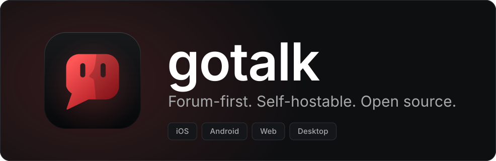

<p align="center">
  
</p>

<p align="center">
  <a href="https://github.com/parkerbrown98/gotalk-client/actions/workflows/ci.yml"></a>
  <a href="https://github.com/parkerbrown98/gotalk-client/releases"></a>
</p>

<p align="center">
  <a href="docs/getting-started.md">Getting started</a> ·
  <a href="docs/development.md">Development</a> ·
  <a href="docs/design-and-theming.md">Design</a> ·
  <a href="docs/README.md">All docs</a> ·
  <a href="https://github.com/parkerbrown98/gotalk-server">Gotalk server</a>
</p>

# Gotalk client

Official client for [Gotalk server](https://github.com/parkerbrown98/gotalk-server)
instances: forum-first communities with topics, real-time chat and voice. One codebase
targets iOS, Android, web and desktop.

The app is not tied to one server. Enter an instance address to connect, and keep a
separate session for each saved instance.

## Table of contents

- [Platforms](#platforms)
- [Quick start](#quick-start)
- [Documentation](#documentation)
- [Connecting to your own instance](#connecting-to-your-own-instance)
- [Development](#development)

## Platforms

| Target | Built with |
|---|---|
| iOS / Android | [Expo](https://expo.dev), React Native and Expo Router in [apps/app](apps/app) |
| Web | The same Expo app exported as a single-page app with `react-native-web` |
| Desktop (Windows/macOS/Linux) | [Tauri v2](https://tauri.app) in [apps/desktop](apps/desktop), wrapping the web export |

[Desktop installers](https://github.com/parkerbrown98/gotalk-client/releases) are published
to GitHub releases. They are currently unsigned; see [Releases](docs/releases.md).

## Quick start

Requirements: Node 22.12+ and pnpm 11. Desktop development also needs stable Rust and the
[Tauri prerequisites](https://tauri.app/start/prerequisites/) for your OS.

```sh
pnpm install
pnpm web          # web app at http://localhost:8081
```

For mobile development use `pnpm dev`; for the desktop shell use `pnpm desktop` instead.
Voice on phones requires a development build, not Expo Go.

See [Getting started](docs/getting-started.md) for target-specific setup, a local server,
CORS, email testing and LiveKit.

## Documentation

| Guide | What's in it |
|---|---|
| [Getting started](docs/getting-started.md) | Requirements, development servers, a local instance, CORS, email and voice |
| [Accounts and instances](docs/accounts-and-instances.md) | Discovery, independent sessions, token storage and web security |
| [Places and invites](docs/places-and-invites.md) | Responsive navigation, permissions and instance-aware invite links |
| [Forums and feeds](docs/forums-and-feeds.md) | Markdown, drafts, paging, optimistic updates and offline read sync |
| [Real-time and chat](docs/realtime-and-chat.md) | Gateway reconnects, caches, channels, threads, offline sends and presence |
| [Desktop](docs/desktop.md) | Window chrome, splash, clipboard, context menus, CSP and debugging |
| [Development](docs/development.md) | Commands, tests, web exports, API types and dependency changes |
| [Architecture](docs/architecture.md) | Workspace layout and shared package responsibilities |
| [Design and theming](docs/design-and-theming.md) | Tokens, Inter, instance branding, motion, mockups and brand assets |
| [Releases](docs/releases.md) | CI, installers, versioning and release tags |
| [Client plan](docs/client-plan.md) | Feature phases, implementation status and roadmap |

Browse the [documentation index](docs/README.md) for guides grouped by task, or
[DESIGN.md](DESIGN.md) for the full visual specification.

## Connecting to your own instance

Choose **Another server** on the welcome screen and enter your instance's address.
The client discovers the API and gateway via `/.well-known/gotalk-instance` and
`GET /api/v1/instance`.

For self-hosting, use [gotalk-server](https://github.com/parkerbrown98/gotalk-server)
and its [getting-started guide](https://github.com/parkerbrown98/gotalk-server/blob/main/docs/getting-started.md).
For local development, the [client setup guide](docs/getting-started.md#connect-to-a-server)
explains the server port and CORS settings.

## Development

```sh
pnpm typecheck
pnpm test
pnpm build
```

Shared packages are consumed as TypeScript source. See [Architecture](docs/architecture.md)
for the layout and [Development](docs/development.md) for live-server tests, API schema
generation and desktop builds.
